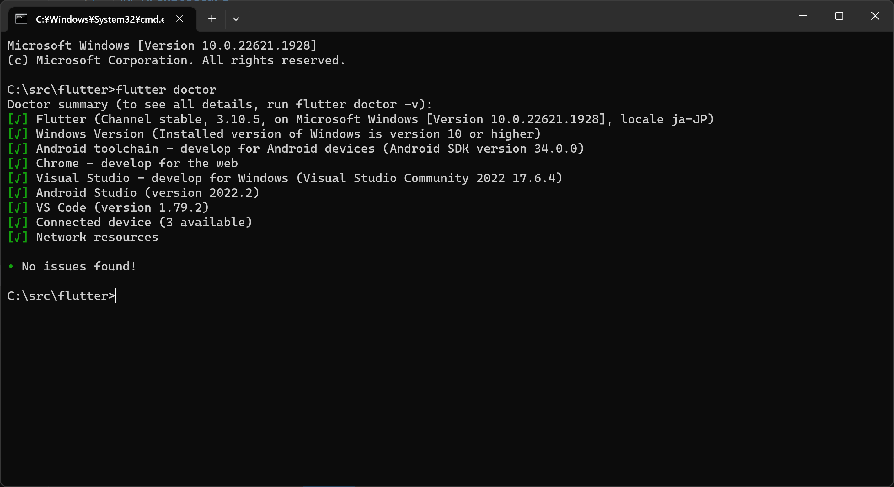

# Dove-Frontend


## Architecture

- **Frontend**: Flutter/Dart: <https://github.com/ohsugi/dove-frontend>
- **Backend**: Rust/Anchor: <https://github.com/ohsugi/dove>
- **Blockchain**: Solana
- **Deployment**: Github/Github Pages

---

## Development

### Environment

1. Follow the below setup guide according to your platform. It would be the perfect guidance.
   - **Entire Guidance**: <https://codelabs.developers.google.com/codelabs/flutter-codelab-first#1>
   - **Set up an editor**: <https://docs.flutter.dev/get-started/editor>
   - **Code formatting**: <https://docs.flutter.dev/tools/formatting#automatically-formatting-code-in-vs-code>
1. There would be related tools needed to work Flutter/Dart/Android Studio correctly ans asked to install in the above guidances.
   - **Visual Studio Code**: <https://code.visualstudio.com/download>
   - **Flutter SDK**: <https://docs.flutter.dev/get-started/install>
     - Recommend to install flutter nearby root directly like `C:\src\flutter`.
   - **Android Studio**: <https://docs.flutter.dev/get-started/install/windows#get-the-flutter-sdk>
   - **Visual Studio**: <https://docs.flutter.dev/get-started/install/windows#android-setup>
   - **JDK**: <https://www.oracle.com/java/technologies/downloads/>
1. One of the key tool would be `flutter doctor` available in the flutter root folder to detect any issues to work flutter and Android Studio correctly and show the guidance to fix the problems.

   

1. Some potencial issues and solutions previously faced were listed for future same problems:
   - Commadline tools: if Android Stduio installer does not install commandline tools, you can find download links in the section named "Command line tools only" the below of the android studio downlods on [this page](https://developer.android.com/studio).
   - You can then boot `sdkmanager.bat` in the commandline-tools/bin folder in it with the argument like `sdkmanager --install "commandline-tools;latest" --sdk_path=<path_to_sdk>.
   - VM Acceleration: <https://developer.android.com/studio/run/emulator-acceleration#accel-vm>
   - You also have to agree the Android Licenses via flutter doctor by `flutter doctor --android-licenses`
1. There would be related environment variables and those examples in my environment.
   - **ANDROID_HOME**: C:/Users/\<user_name>/AppData/Local/Android/Sdk
   - **ANDROID_USER_HOME**: C:/Users/\<user_name>/.android
   - **PATH**
     - **VS Code Bin**: C:/Users/\<user_name>/AppData/Local/Programs/Microsoft VS Code/bin
     - **JAVA Home**: C:/Program Files/Common Files/Oracle/Java/javapath
1. It would be a great way to catch up on the basics by coding a simple app with the following tutorial.
   - <https://docs.flutter.dev/get-started/codelab>

### Dependencies

1. You can add the dependencies by the below command.

   > flutter pub add <package_name>

1. You can update the dependencies by the below command.

   > flutter pub upgrade

1. You can check the outdated dependencies by the below command.

   > flutter pub outdated

1. Right click on `pubspec.yaml` and select `Get Packages` or type `flutter pub get` on your terminal to install dependencies.
   - If you will get some issues, once you can clean up the dependencies from the cache by typing `flutter clean` and reinstall the dependencies might clear those issues sometime.

### Dart Fix

1. You can use dart fix to fix some issues automatically by typing the below command on the terminal. Details are explained on [this page](https://dart.dev/tools/dart-fix).

   ```bash
      dart fix --dry-run
      dart fix --apply
   ```

### Migrate to Null Safety

1. Check the null safety of the project by the below command.

   > dart pub outdated --mode=null-safety

1. Migrate to null safety by the below command.

   > dart migrate

### Debug

1. You can use DevTools by opening Command Pallete by selecting [View]->[Command Palette] or `Ctrl + Shift + P` and type `> Flutter: Open DevTools` and then select for instance `Open Widget Inspector Page` to open Widget Inspector.

### Build

### Build Configuration with dotenv

1. Create `.env` file in the root folder and copy the below content to it.

   ```.env
      http_cluster=localnet
      app_uri=https://my_dapp.com
      app_icon_uri=favicon.png
      app_name=Dove
   ```

#### Android

1. Check gradle version and the related parameters below if you got some error to build for Android emulator.

   - project_root/android/settings.gradle

     ```gradle

        plugins {
         ...
         id "com.android.application" version '8.4.2' apply false
         ...
        }
     ```

   - root/android/gradle/wrapper/gradle-wrapper.properties

     > distributionUrl=https\://services.gradle.org/distributions/gradle-8.6-bin.zip

1. You also can check compatible Java version with Gradle version on the below page.

   - <https://docs.gradle.org/current/userguide/compatibility.html>
     - E.g., Gradle 8.4.x is compatible with Java 21

1. Adding a launcher icon

   - <https://docs.flutter.dev/deployment/android#adding-a-launcher-icon>

1. Build an APK for debug and trial use

   - For apk (Android) you need to run the command :

     > flutter build apk --release

   - If you want to split the apks per abi (Split Apk) then run

     > flutter build apk --target-platform android-arm,android-arm64,android-x64 --split-per-abi

   - For ipa (iOS) you need to run the command :

     > flutter build ios --release

   - `--release` is optional as it is by default if you need debug build, just replace `--release` with `--debug`
   - you can find the released APK or IPA files form

     > build/app/outputs/flutter-apk/app-release.apk

   - Rename the apk file to `dove.apk` and move it to the online folder.

#### Updates Gradle, Android Gradle Plugin, and Kotlin

1. You can open Android Studio and check the update notification on the bottom right corner of the window. You can also check `Help` -> `Check for Updates` to update Android Studio.

1. Update Gradle version and the corresponding Android Gradle Plugin version in the below files.

   - root/android/gradle/wrapper/gradle-wrapper.properties

     > distributionUrl=https\://services.gradle.org/distributions/gradle-8.6-bin.zip

   - project_root/android/settings.gradle

     ```gradle

        plugins {
         ...
         id "com.android.application" version '8.4.2' apply false
         ...
        }
     ```

1. Update Kotlin version in the below files.

   - root/android/app/build.gradle

     ```gradle
        def kotlin_version = "1.8.0"
        dependencies {
           implementation 'com.android.support:multidex:1.0.3'
           implementation "org.jetbrains.kotlin:kotlin-stdlib-jdk7:$kotlin_version"
        }
     ```

1. Open Android Studio and click `File` -> `Sync Project with Gradle Files` to update the Gradle and Android Gradle Plugin.

   - This command will update the Gradle version and the Android Gradle Plugin version. This can also identify some issues and ask you to fix them.

1. Click `Tools` -> `AGP Upgrade Assistant` to update the Android Gradle Plugin.

   - You need to align the Gradle version and the Android Gradle Plugin version. You can also check the compatibility of the Gradle version and the Android Gradle Plugin version on the below page.
     - <https://developer.android.com/studio/releases/gradle-plugin#updating-gradle>
   - You can also check the compatibility of the Gradle version and the Kotlin version on the below page.
     - <https://kotlinlang.org/docs/releases.html>
   - You should specify Android Gradle Plugin version in the below file (e.g., 8.4.2 in the below example).

     - project_root/android/settings.gradle

       ```gradle

          plugins {
           ...
           id "com.android.application" version '8.4.2' apply false
           ...
          }
       ```

## Credit

The first code base was created based on the below template. The code was then modified to fit the needs of the project.

- <https://github.com/abuanwar072/E-commerce-Complete-Flutter-UI>

The Dove Frontend is using the below images/icons on the app.

- By Boris Chilingaryan - Own work, CC BY-SA 4.0, <https://commons.wikimedia.org/w/index.php?curid=120461277>
- By Creative Tail - <https://www.creativetail.com/40-free-flat-animal-icons/https://archive.is/lE5aD>, CC BY 4.0, <https://commons.wikimedia.org/w/index.php?curid=47524126>
- By Searchprivacyexpert - Own work, CC BY-SA 4.0, <https://commons.wikimedia.org/w/index.php?curid=65221873>
- By VateGV - Own work, CC BY-SA 4.0, <https://commons.wikimedia.org/w/index.php?curid=63793145>
